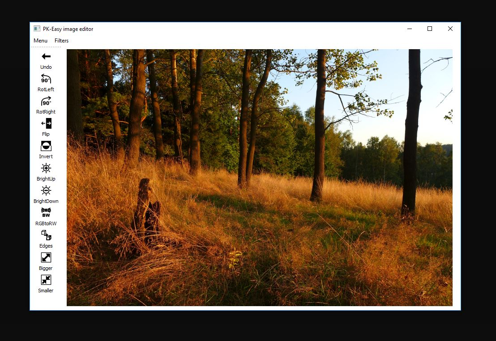

# PK - easy image editor

Made for school project (CTU in Prague). It's primitive image editor with basic image operations. Goal of the Project was use only python and numpy for implementation of image operations.
### School project requirements
	* open
	* save
	* rotating image(both directions)
	* mirroring
	* inverting image
	* RGB to BW
	* brighten and darken
	* edge enhancement
### Other functions
	* undo
	* enlarge preview
	* reduce preview
	* crazy rainbow filter (its not working well)
	
Turn it on in the command line (python 64 bit recommended)

	
